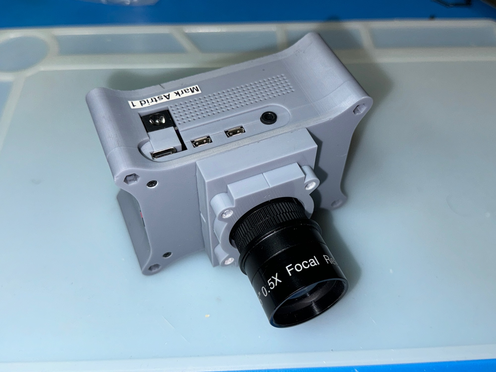
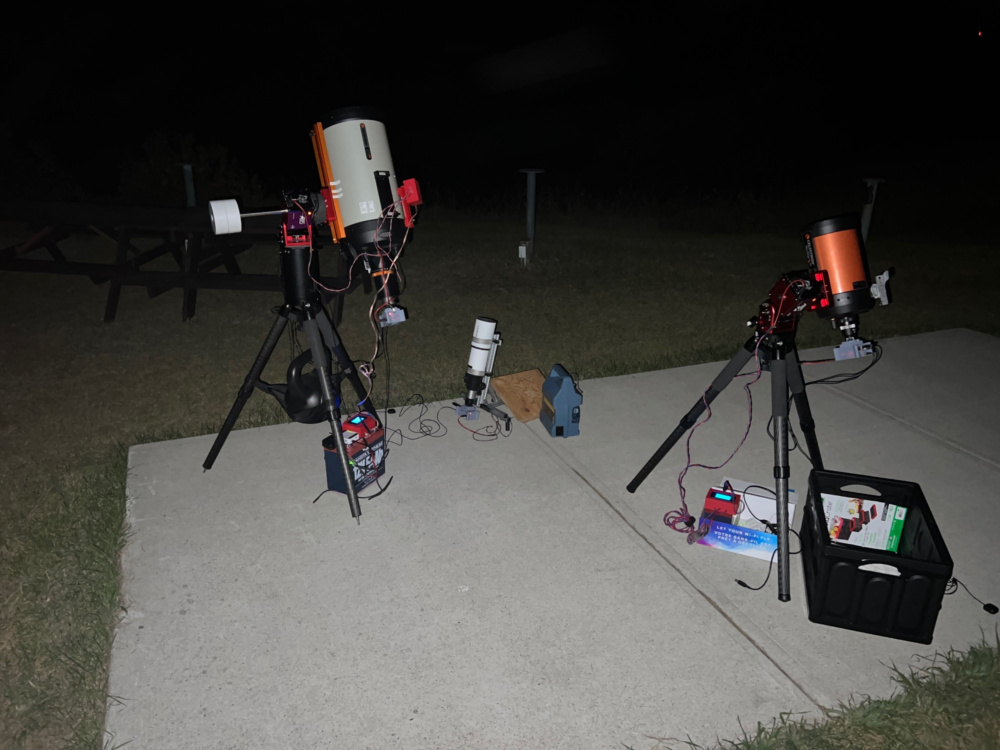
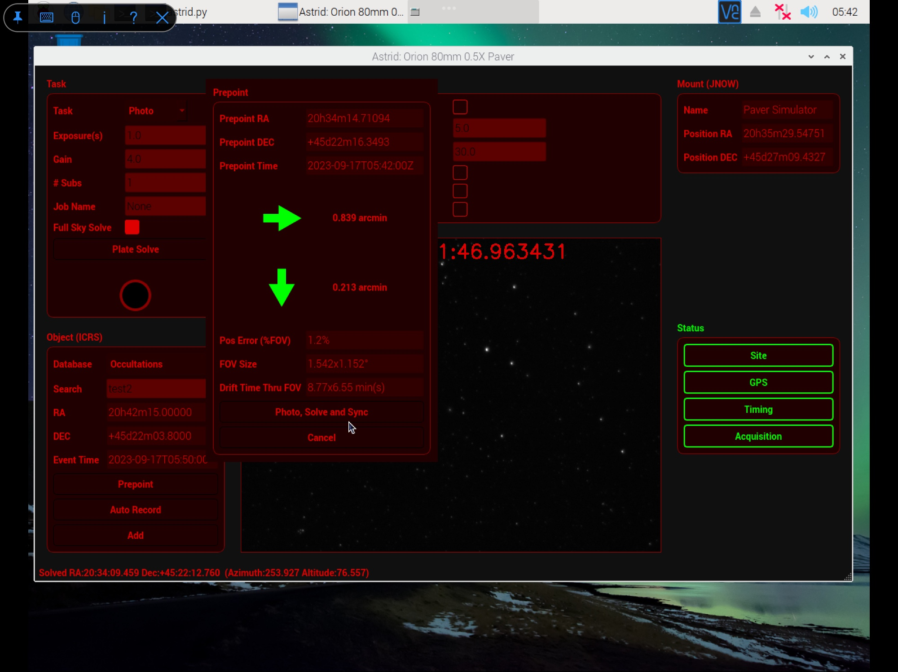
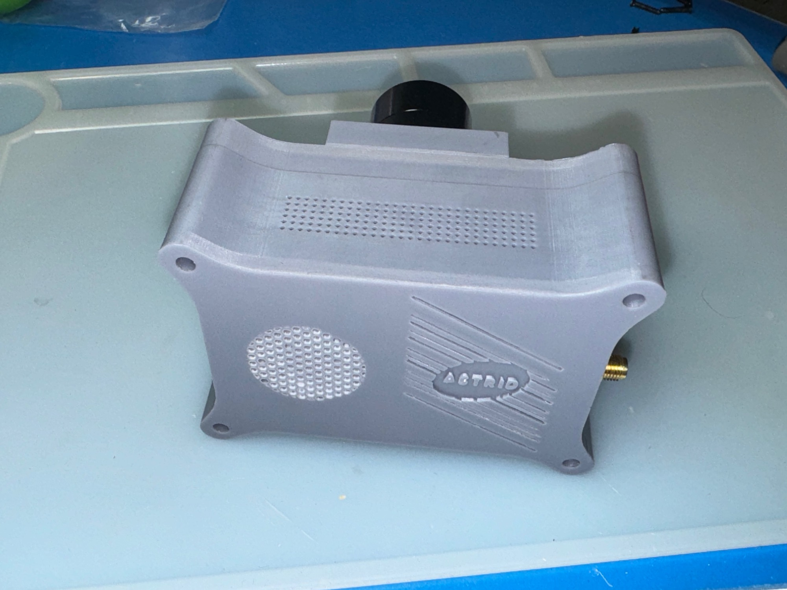
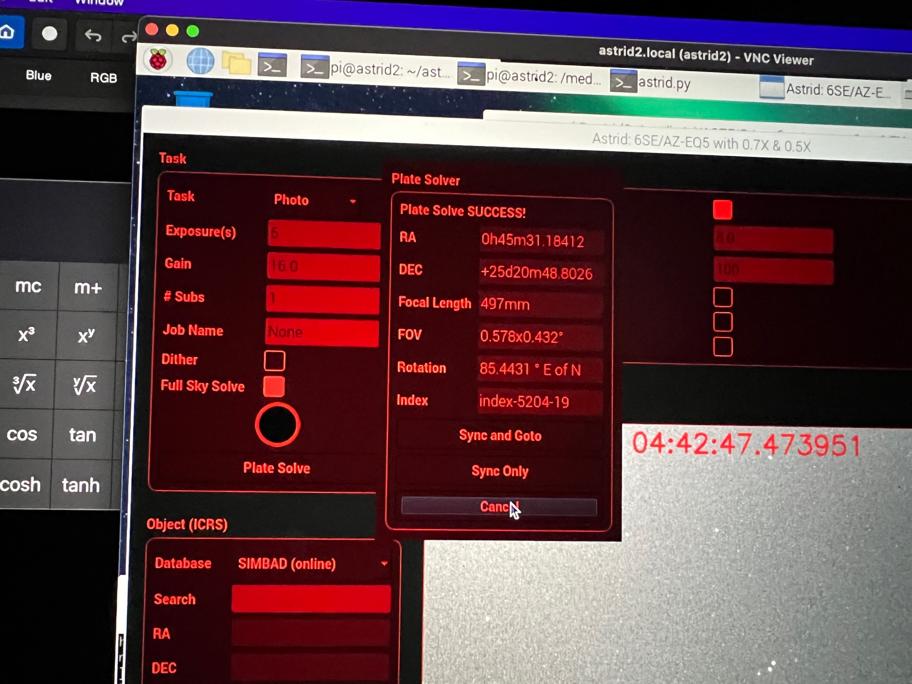

# Astrid (ASTro Imaging Device)

## Introduction

Astrid is a device, software and hardware to record astronomical Occultations, Transits, Eclipses (OTE), and Astrophotography.  Occultations are rare, and having equipment for rare events means that the equipment is unused at other times.  The concept of Astrid is that the device can be used as a general astrophotography camera when occultation work is not being done.  

Astrid compromises of:

* Raspberry Pi 4 Model B - 8GB (4GB untested)
* IMX296 Mono Camera [CAM-MIPI296RAW-Trigger](https://www.inno-maker.com/product/cam-mipi296raw-trigger/)
* [OTEStamper](OTEStamper) Timing board
* Software and Firmware

Astrid has the following features:

* Highly accurate frame timestamping for occultations using GPS
* Global Shutter (Sony IMX296 Sensor Mono)
* Controlled over VNC from Tablet/Computer/Phone (one can control many Astrids)
* Can be paired with a telescope or camera lens
* Audit trail for video
* GPS Position/Altitude
* Plate Solving
* Mount support: [IndiLib](https://indilib.org)
* Focuser support: [IndiLib](https://indilib.org) - Coming Soon
* Goto
* Star Detection
* Stretch
* Uncompressed raw data/video
* .fits file (photos)
* [Raw Astro Video Format (RAVF)](https://github.com/ChasinSpin/ravf) files for video (occultations)
* [PyMovie Support](https://github.com/ChasinSpin/pymovie)
* Dithering
* Multiple Subs
* Occelmnt support
* Occultation metrics
* Unattended Pre-Pointing

## PyMovie

Astrid [Raw Astro Video Format (RAVF)](https://github.com/ChasinSpin/ravf) can be loaded in PyMovie for analysis, using [RAVF PyMovie](https://github.com/ChasinSpin/pymovie).

## Documentation

[Documentation](docs/README.md)

## Obtaining Astrid

Astrid is now being supplied fully built and ready to go from IOTA.  Please see:
[https://occultations.org/astrid-details-and-ordering-page/
](https://occultations.org/astrid-details-and-ordering-page/)

Please note that although Open Source software is free, it is also generally considered good practice to support the time / resources that are donated by authors by purchasing through approved channels like IOTA where available.  That way the software/hardware can continue to be developed. Limited support is also available if one of the approved boards is purchased. 

If you build the board yourself, or it was obtained from another, we are unable to provide support. There has been instances of people making boards, selling them to others for profit and then expecting assistance for free.  We do not have the resources to support these types of ventures.

## Credits

* Steve Preston of IOTA for his invaluable assistance
* Bill Yeung for testing
* Bob Anderson for PyMovie
* Dave Herald - Star Catalogs and Occelmnt
* Hristo Pavlov for OWCloud