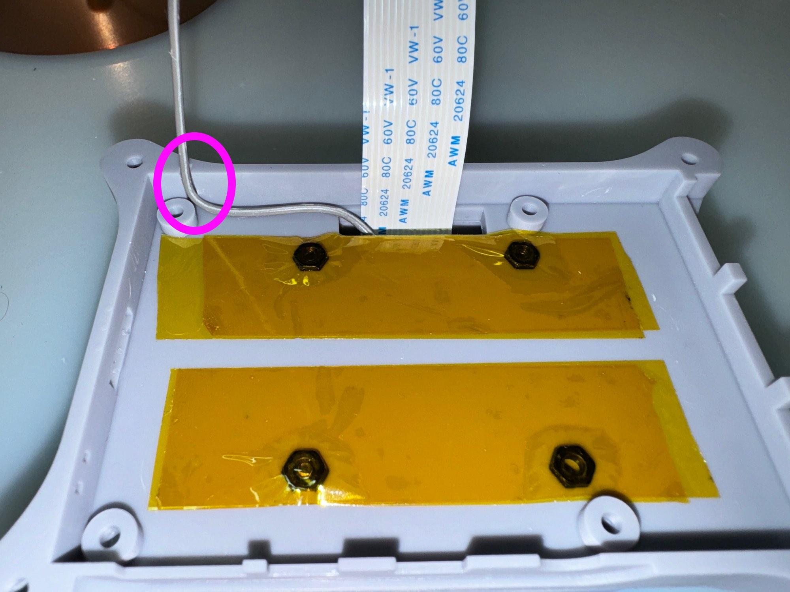
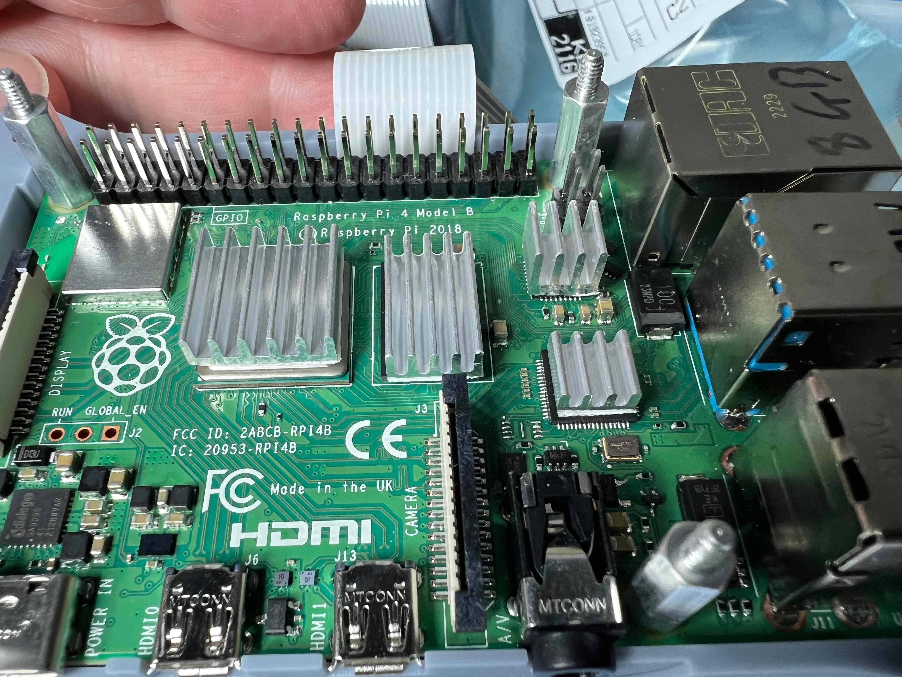

# Assembly Guide - Partial Kit (Skill Level Beginner)

Astrid can be purchased with some parts pre-assembled, this is known as the "Partial Kit". The kit also requires some additional parts that you will need to purchase separately. These instructions detail how to assemble the partial kit and the parts you need to purchase to build a working Astrid.

If you do not wish to purchase the Partial Kit, then you will need to [Make Your Own Kit](BuildKit.md) first prior to following these instructions.

Assembly time is approximately 15mins for the hardware, maybe a little longer if it's your first time.

## Partial Kit

The partial kit includes:

* OTE Stamper Board (timing board)
* Sony IMX296 Global Shutter Mono Camera (Modded)
* GPS and Active 30dB External Antenna
* Resin 3D Printed Case
* Required Hardware (screws, cables etc.) to complete assembly

## What You Need To Purchase

| Quantity | Description |
| -------- | ----------- |
| 1 | [Raspberry Pi 4B - 8GB](https://www.amazon.com/Raspberry-Quad-core-Cortex-A72-Wireless-Bluetooth/dp/B0B6ZJGF4Q/ref=sr_1_4?crid=1GMQMIJNPZFXC&keywords=raspberry%2Bpi%2B4B%2B8GB&qid=1695578564&sprefix=raspberry%2Bpi%2B4b%2B8gb%2Caps%2C167&sr=8-4&th=1) |
| 1 | [Sandisk 64GB Extreme Pro SD Card SDSQXCU-064G-GN6MA](https://www.amazon.com/SanDisk-Extreme-microSDTM-Adapter-SDSQXCU-064G-GN6MA/dp/B09X7BYSFG/ref=sr_1_5?crid=XY2MS7SKI8MN&keywords=64GB+sandisk+extreme&qid=1695578628&sprefix=64gb+sandisk+extrem%2Caps%2C189&sr=8-5) |
| 1 | [Sandisk 128GB Extreme Pro USB 3.2 SDCZ880-128G-GAM46](https://www.amazon.com/SanDisk-128GB-Extreme-Solid-State/dp/B08GYM5F8G/ref=sr_1_3?crid=3V64CEU0M0KOW&keywords=SanDisk%2B128GB%2BExtreme%2BPRO%2BUSB%2B3.2%2BSolid%2BState%2BFlash%2BDrive%2B-%2BSDCZ880-128G-GAM46&qid=1695578870&sprefix=sandisk%2B128gb%2Bextreme%2Bpro%2Busb%2B3.2%2Bsolid%2Bstate%2Bflash%2Bdrive%2B-%2Bsdcz880-128g-gam46%2Caps%2C237&sr=8-3&th=1) |
| 1 | [Battery/Power](PowerSupply.md) |
| 1 | [12V Power Lead](PowerSupply.md) |
| 1 | [0.5X IOTA 1.25" Focal Reducer (CS Mount) and 3 Extension Rings](docs/UsageGuide.md#focal-reducers-and-length) - usually required | 

## Tools Required

* Small Pliers
* Phillips Screw Driver (long shaft, thin, shaft diameter max 4mm)

## Astrid Assembly

The case in the Partial Kit is supplied-semi assembled to show how everything fits together, you will need to dissemble the case first.
	
* Remove the 4 screws holding the case together, be careful not to lose the nuts.

	
	
* Remove the nut and lock washer from the "gold" colored GPS pig-tail and remove the pig-tail from the case to make it easier to work on.

	

* Remove the 4 screws holding the camera cover to the case and remove the camera cover.

	
	
* Remove the 4 screws holding the OTEStamper board to the case.

	
	
* Find the following parts.

	
	
* Orient the camera on the case bottom and put the Flat-Flex and 0.1\" header cables through the slot.

	
	
	
* Place the Raspberry Pi 4B - 8GB on the other side of the board.  Be sure to locate the 0.1\" header cable in the notch on the left-hand side as shown.

	

* Attach Raspberry Heatsinks to the board as shown.

	
	
* Pull up the black lever on the Raspberry Pi connector for the camera.

 	

* Insert the Camera Flat-Flex into Raspberry Pi, note the orientation of the Flat-Flex (blue reinforcement) and the twist.

 	

* Push down the black lever on the connector until back in the original position on both sides.

 	
	
* Place the OTEStamper board on top of the Raspberry pi as shown with the flat flex cable coming out to the side.

	
	
Be sure that the camera Flat-Flex is not being clamped between the Hex Standoff and the OTEStamper board.  This cable routing makes it less likely that a cable can be fouled by the Fan.

* Put the 4 - 2.5mm x 10mm bolts in from the bottom of the case into the hex standoffs and screw the Raspberry Pi and OTEStamper board to the case.
 
	
	
* Attach the Camera Cover over the Camera board and use the 4 - 2.5mm x 14mm bolts to screw it down.  The Camera Cover should sit flush.

 	
 	
* Route the 0.1\" header cable as shown and connect to the XVS pin.

 	
 	
* Attach the GPS pig-tail to the case with the retaining washer inside the case and the lock washer and nut on the outside.  Tighten carefully with pliers so the connector does not rotate in the case.

 	

* Attach the fan jumpers to the OTEStamper board.  Note that the negative lead is closest to the 12V DC input jack.

 	
 	
* Carefully close the case making sure nothing is fouling the fan and the flat-flex and cables are not caught in the case.  Using 4 - 2.5mm x 14mm bolts and 4 - 2.5mm nuts, bolt the case together.

 	
 	
 * [Build the SD CARD](InstallImage.md)

 * Insert the SD Card in the orientation shown and push in till level with the case.

 	
 	
 	
 * Remove the cap from the sensor, visually check there's no dust on the sensor (use a camera puffer if there is), and screw 2 extension rings, the CS to 1.25\" adapter and the 0.5X Focal Reducer on and cap with the yellow cover.
 
 	
 	
* [Build The USB Flash Drive](FlashDriveLayout.md)