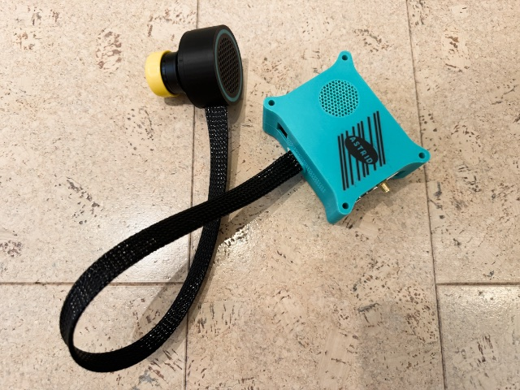

# Astrid - Prime Focus

## Introduction

The Astrid - Prime Focus case is a version of Astrid that separates the camera from the processing unit to reduce the footprint for prime focus setups.  A prime focus setup is where the camera is located at the front of the telescope instead of the rear.  i.e. HyperStar SCTs, Suitcase Mounts (Broughton), Rasa, Prime Focus Newtonians, etc.  It can also be used for smaller Dobsonians, which are typically intolerant of extra wait at the eyepiece.

Astrid—Refractor (the all-in-one unit) is still the recommended solution for SCTs that are not Hyperstars, Newtonians that still have their eyepiece holders and Refractors.

Astrid - Prime Focus Case consists of 2 parts joined by a cable:

* Camera
* Astrid

The cable between these 2 parts is 19 inches +/—1 inch. As the camera will be mounted in the middle, it can accommodate scopes up to 30 inches in diameter.  If you have a larger telescope than this, please contact us for a longer custom cable.

This camera case is 3D printed in black (with a turquoise highlight on the nonvisible side), has no lights, and has the Flat Flex cable and a single thin wire coming out of the vertical slot. If you have a spider vane, the cables can be taped to that, with or without the wire sleeve.

The remainder of Astrid is a separate unit you can place somewhere outside of the mirror capture area e.g. on the side of the scope. Adhesive Velcro is the suggested way to do this.

This approach has a few advantages:

* The obstruction of this camera is only 59mm (the diameter of the case):
	* This is smaller than ZWO’s smallest cameras for example (62mm).
	* For HyperStar, this means that for 8” scopes and up, it’s smaller than the secondary mirror obstruction and, therefore, doesn’t block light, and for 6” (56mm obstruction) scopes, it only overspills by 3mm.
	* For RASA, the central obstruction is 93mm and far larger than the Astrid camera
* Maximizes photons coming in by not creating a big obstruction
* Only 2 thin cables to route (flat flex (1mm x 16mm) and a 1mm single wire), i.e. no large thick power cables
* Heat generation in front of the mirror is limited to the small heat generation of the camera
* No fans to disturb airflow in front of the mirror
* No LEDs to worry about
* These cables can be routed over your existing support structure (for Hyperstar / Rasa it can be anchored at the side using a radius curve)
* This approach won’t create any noticeable diffraction spikes if a radius curve is maintained (if your support structure or other items generate spikes, those will remain the same of course)

If you’re rough with equipment, the cable assembly is considered a consumable, and you can replace it easily.  **DO NOT FOLD THE FLAT FLEX**

## BOM (Bill Of Materials)

*(For IOTA Construction or User Repair Only)*

| Quantity | Part | Description | Manufacturer | Supplier | Supplier Part # |
| -------- | ---- | ----------- | ------------ | -------- | --------------- |
|1|Raspberry Pi Camera Cable 610mm|Adafruit 15-pin 610mm 1731|Adafruit|DigiKey|1528-1791-ND|
|2|Crimp|0.1" Connector 28awg Crimp Gold|Harwin Inc.|DigiKey|M20-1160042|
|51cm|PET Expandable Sleeving 5/8"|Expandable Sleeving 5/8" X 100' Black PTN0.63BK100|Techflex|DigiKey|1030-PTN0.63BK100-ND|
|70cm|Silicone Wire|28awg Silicone Wire multistranded|Anjukee Store|Amazon|[Amazon Link](https://www.amazon.com/dp/B0D6V75XDW)|
|18mm|Heatshrink Tubing|Heatshrink Tubing 3:1 shrinkage, 3mm internal diameter|Any|Digikey|2786-B2(3X)3/1BLACKSPL-DS-ND (untested, but should fit)|

## Assembly Instructions

*(For IOTA Construction or User Repair Only)*

* Cut 51cm long piece of PET Expandable Sleeving
* Cut 70cm long piece of silicone wire
* Weld ends with clamps, allowing about 1cm overflow of the sleeving at each end
* After construction, clamp to clamp should measure approximately 48cm.
* Insert cables, ensure camera end had 6.5cm of Flat Flex past the clamp and 10cm of the silicone wire.

See [YouTube Video](https://youtu.be/KbivtE_ajuM)
