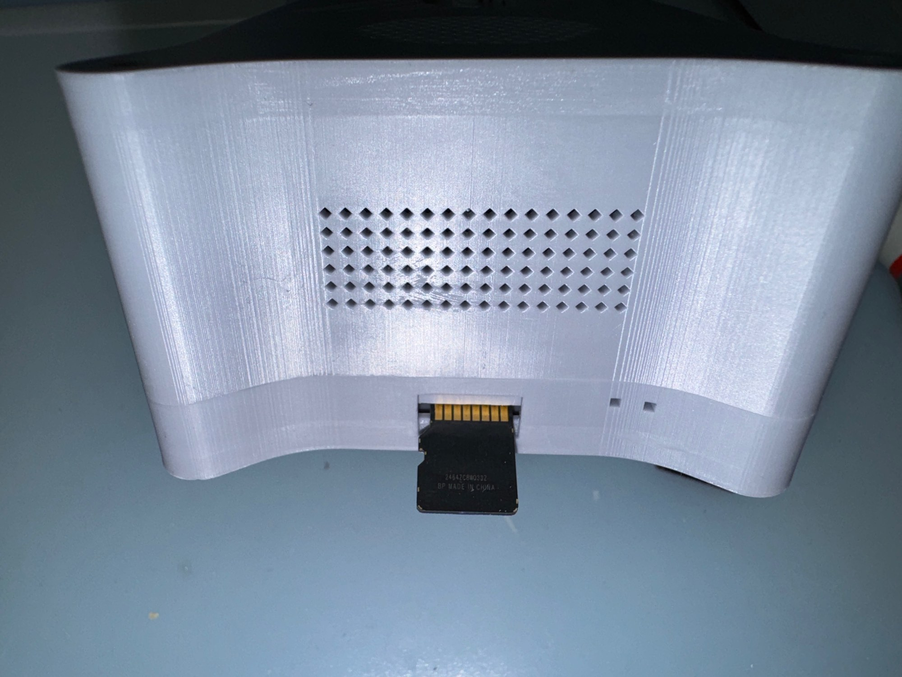

# Usage Guide

* [Startup](#startup)
* [Wi-Fi](#wi-fi)
* [First Light](#first-light)
* [Connect Via VNC](#connect-via-vnc)
* [Internet Access Optional](#internet-access-optional)
* [Focal Reducers And Length](#focal-reducers-and-length)
* [Multiple Astrids](#multiple-astrids)
* [Our Setup](#our-setup)
* [SSH And SFTP](#ssh-and-sftp)
* [Prepointing](#prepointing)

## Startup

* Insert microSD Card into ASTRID.  Note the contacts on the card face towards the logo on ASTRID.  Be careful to insert it into the socket (*not beside it*).
* Insert USB Flash drive **in BLUE USB port (USB 3.1)** on ASTRID.  Note the black USB ports are slower than USB 2.0.
* Connect GPS Antenna (ensure it has a clear view of the sky, see [Troubleshooting](Troubleshooting.md)
* Connect mount if using to any remaining USB port.
* Connect the focuser if used to any remaining USB port.
* Power mount on.
* Power ASTRID on.
* **ALWAYS REMEMBER TO SHUTDOWN ASTRID AND WAIT 15 SECONDS AFTER GREEN LIGHT STOPS FLASHING ON THE SIDE BEFORE REMOVING POWER TO AVOID SD CARD AND USB FLASH DRIVE CORRUPTION.**
* Keep sensor clean.  The best way to do this is to use a camera puffer and keep the sensor covered at all times, either with a cap or a focal reducer.  If you need to clean the sensor, use a regular sensor cleaning kit.  As with regular astrophotography, a dirty sensor is indicated by sharply focused defects on the image (*less defined defects are dirt on the lens or telescope*).
* [Connect via VNC](#connect-via-vnc)

## Wi-Fi

Astrid uses [AutoHotspot](https://www.raspberryconnect.com/projects/65-raspberrypi-hotspot-accesspoints/157-raspberry-pi-auto-wifi-hotspot-switch-internet#:~:text=AutoHotspot%20Script,-This%20is%20the&text=Allowing%20all%20connected%20devices%20to,be%20used%20with%20hidden%20SSID%27s.) to manage Wi-Fi connections, these can be configured via the "Wifi Setup" icon on Astrid's desktop.

Astrid looks for a Wi-Fi connection it knows first and will connect to it when found, if no network is found, then it will create its own Access Point that can be connected to.  If you are ever having problems finding Astrid, then look on your list of networks to see if AstridHotspot is visible and connect with:

|           |                |
| --------- | -------------- |
| Wi-Fi SSID | AstridHotspot |
| Wi-Fi Password | iotaiota |
| Hostname | astrid.local |

If Astrid can see multiple networks it knows, then it may connect or change between them randomly.

Once every minute, networks are checked, and Astrid may switch to a new network if visible.  So for example, if you are connected to "my\_ssid" and "my\_ssid" goes down, Astrid will after upto 1 minute, look for another network it knows and switch to that, or if one is not available, it will switch to creating it's own access point, e.g. "AstridHotspot"

So, if you can't connect, then look for the possibility of Astrid being on another network. 

##### If you are hot-spotting through a phone to connect to Astrid, be aware that some cellular plans limit throughput through the phones hotspot and may result in very slow VNC response.

## First Light

When Astrid is started for the first time, no Wi-Fi networks are configured and it will default to 

|           |                |
| --------- | -------------- |
| Wi-Fi SSID | AstridHotspot |
| Wi-Fi Password | iotaiota |
| Hostname | astrid.local |

To connect, you will need to connect to this Wi-Fi network you will need to use VNC, see [Connect Via VNC](#connect-via-vnc).  Once connected, you can use the "Wi-Fi Setup" icon on your desktop to add Wi-Fi networks you require.

When using Astrid for the first time, or with a new telescope / focal reducer configuration, it's important to determine the focal length and configure the [platesolver](Platesolver.md).  See [Platesolver](Platesolver.md) for more information.  Once plate solving is working, then you can Polar Align (if an equatorial mount) and then goto a bright star and focus precisely with a Bahtinov mask.

## Connect Via VNC

Connection to the Astrid app and desktop is through a VNC Client over Wi-Fi.  You can access Astrid with the following devices:

* Laptop (macOS, Windows, Linux, Raspberry Pi)
* Tablet/iPad (iOS or Android)
* Phone (iOS or Android) *small screen size = poor user experience*

For convenience in mobility and user experience, whilst moving around the telescope, we use an iPad with a larger screen size.

The VNC Client we recommend is the free [RealVNC VNC Viewer](https://www.realvnc.com/en/connect/download/viewer/) (note you may be prompted for a free trial, but it's not necessary).  Other clients may or may not work.

When setting up the client, we suggest you use "astrid.local" for the hostname instead of an IP address.  As you may access Astrid on different networks or its Access Point, using "astrid.local" instead of an IP address removes the need to have a different connection for each network.  

##### Please note that it may take 1-2 mins after connection for "astrid.local" to be visible on the network.
	
To add Astrid to VNC Viewer:

1. Click on the "+" button
2. Address: astrid.local
3. Name: astrid.local
4. Picture Quality: Automatic
5. Interaction: Touch Panel (Tablet) or Mouse (Computer)
6. Update desktop preview: On or Off
7. Click Done

The username / password to login to Astrid when prompted via VNC:

|           |                |
| --------- | -------------- |
| Login | pi |
| Password | iota |

### Entering Text Into Astrid

Text in VNC Viewer is entered by tapping the keyboard icon.  When entering text, be aware that you must **ALWAYS** press "Return" or "Enter (some computers)"  after the text has been entered so that the text is accepted.

### Powering Off

Quitting or closing the VNC connection, does not shut down Astrid.  
**ALWAYS REMEMBER TO SHUTDOWN ASTRID AND WAIT 15 SECONDS AFTER GREEN LIGHT STOPS FLASHING ON THE SIDE BEFORE REMOVING POWER TO AVOID SD CARD AND USB FLASH DRIVE CORRUPTION.**

	
## Internet Access Optional

Astrid is designed for both offline and online use.  Astrid currently does not contain star catalogs, therefore to find a target that is not already saved, it uses Simbad which requires internet access.

Target objects can either be entered via Astrid for offline use (*custom Objects or Save from Simbad*) or copied onto the corresponding objects.json(*custom objects*) or occultations.json on the USB Drive.

## Focal Reducers And Length

Focal length will depend on the focal reducers used and the distance the camera sensor is from a lens or the telescope.  The typical requirement of an accurate back focus may not be necessary with ASTRID due to the smaller field of view.
 	
If using the IOTA 0.5X Focal Reducer, be aware that you may need to insert spacer rings to get the maximum focal reduction.
 	

## Multiple Astrids

Each Astrid should have a unique hostname to avoid confusion in which one you are connecting to.

You can change the hostname as follows:

1. Make sure only 1 Astrid is on and connect to it via VNC.
2. Double click/tap the terminal icon top left (black rectangle with >\_)
3. Type:    sudo raspi-config
4. Choose: 1. System Options	(use cursor arrows, tab and enter to navigate)
5. Choose S4 Hostname
6. Enter the hostname you require (do not add .local)
7. Select OK and then Finish
8. When prompted to reboot, select Yes

Now update your VNC Address to point to the new hostname.local

## Our Setup

We use an iPad (with brightness turned down so that it lasts the night) to access Astrid.  This gives us the ability to easily move around the scope and no requirement to bring a table to place a laptop on, or bring power for it.

For Wi-Fi we have the following configured in Astrid:

* Home Network
* AC750 Tp-Link Travel Router (for Mobile deployments)

Astrid then automatically connects to our home network, or the travel router when we're mobile.  If we need a Simbad lookup, then we just enable the hotspot on the phone, and after a few seconds, the travel router connects to the hotspot automatically and Astrid has internet for object searches.

By no means is the Travel Router required, we just find it convenient for all situations (good cellular, poor cellular), as well as multiple connections and increased Wi-Fi range.  This particular travel router is low-powered and will easily run off a small 10Ah USB power pack.

For telescope/mount (focal length 732mm):

* Celestron EdgeHD 9.25"
* 0.7X Celstron Focal Reducer
* 0.5X IOTA Reducer (Ted Blank)
* ZWO AM5 Mount
	* Dakota 12V Lithium Battery (54Ah, but overkill, 10Ah-23Ah is sufficient)

## SSH And SFTP

To ssh or sftp to Astrid:

* ssh pi@astrid.local
* sftp pi@astrid.local

The password is: iota

## Prepointing

Astrid has the ability to automatically calculate prepointing positions without needing star charts or setup at a specific time, such that once
setup, the star drifts into view and recording starts automatically.

Prepointing is useful in certain situations, for example:

* Unattended single or multiple setups
* Setups with no Goto / Tracking (i.e. statically pointed)
* Rough polar alignment

For the best success with prepointing:

* Short focal lengths ( <400mm )
* Short occultations

To prepoint, click the Prepoint button when Occultations is selected in Object.  The process is iterative, so click Photo, Solve, Sync and then adjust the mount and repeat until the error is minimal, the follow metrics reported are useful:

Pos Error(%FOV) = The positional error in percentage of the height of the FOV for the sensor.  This is another way of quantifying the position error displayed in the arrows.  I.E. I have this much error, am I close enough to the center?  It's suggested to adjust the mount until 10% or better is reached.  At 50%, it is half the field of view, and that will mean that the star is at the edge of the frame.

FOV Size = Size of the Field of View

Drift Time 75% FOV: This is the number of minutes it takes to drift across 75% of the FOV Height.  The occultation event should fit within this time.

When prepointing is adjusted, then the Auto Record button can be pushed to auto record when the event begins.

## Light Curve Analysis

The recommended tool for analyzing light curves from Astrid is Bob Andersons awesome [PyMovie](https://pypi.org/project/pymovie/) and [PyOTE](https://pypi.org/project/pyote/)

Starting from version 3.9.4 of PyMovie, the RAVF Video format used by Astrid is natively supported.

Other light curve analyzers currently do not support the RAVF video format. A conversion utility to fits is on the todo list.

